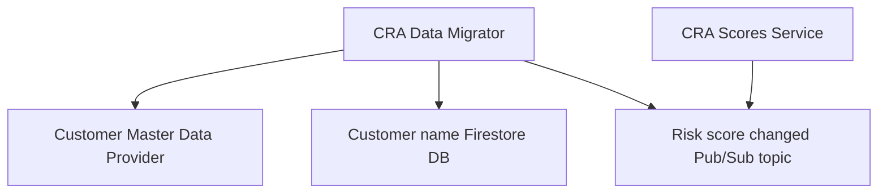

# CRA Data Migrator

This is a .NET Core microservice responsible for receiving risk score updates and storing data in the analytical
database.
## Dependencies

## Datastore Usage

* The service uses a [Firestore](https://firebase.google.com/docs/firestore) for storing customer name.
* The service uses [BigQuery](https://cloud.google.com/bigquery) analytical database to store historical records of the calculated risk rating for users.

* The service uses [Vault](https://vault.q3.questech.io/ui/vault/secrets/secret/list) for storing secrets.

## Links:
* [Wiki page](https://confluence.questrade.com/display/DIB/CRA+Data+Migrator)
* [Dashboard](https://app.datadoghq.com/dashboard/auw-pj4-d52?tpl_var_app=cra-data-migrator&tpl_var_container=cra-data-migrator&tpl_var_env=prod&tpl_var_kube_namespace=cra-data-migrator&tpl_var_risk_scores_updated_subscription_id=system.customer-risk-assessment.risk-scores-internal.updated-1.0.cra-data-migrator&tpl_var_risk_scores_updated_topic_id=system.customer-risk-assessment.risk-scores-internal.updated-1.0&tpl_var_service=cra-data-migrator&from_ts=1661162117851&to_ts=1661165717851&live=true)
* [Monitors](https://app.datadoghq.com/monitors/manage?q=tag%3Aservice%3Acra-data-migrator)

## Resiliency patterns/degradation features

- The requests to the [GraphQL] use retry policy with exponential back-off
- API uses cloud data storage (Firestore) to avoid any data related issues
- All Pub/Sub consumers are idempotent

## Contact

Slack Channel: [#team-tmj](https://questrade.slack.com/archives/C03J8C42TF1)
Alerts Channel: [#fincrime-fraud-aml-alerts](https://questrade.slack.com/archives/C04265WLMTR)
Email group: questrade-scrumteam-tmj@questrade.com
